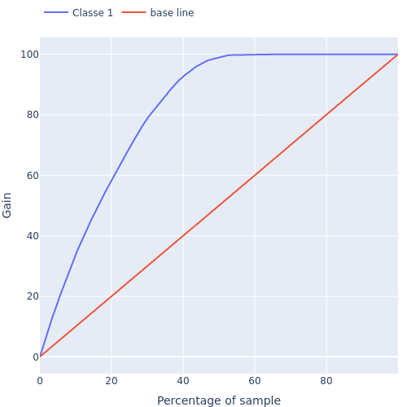
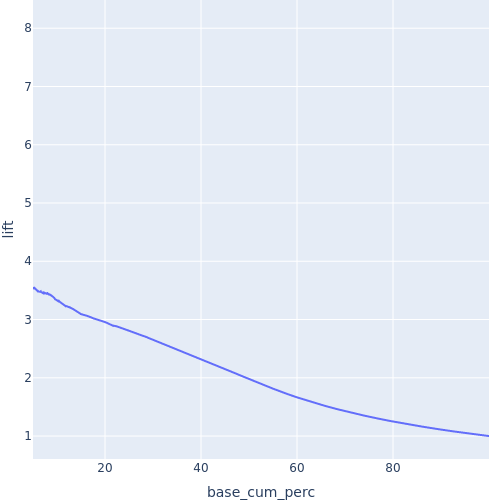
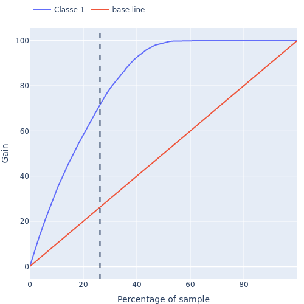
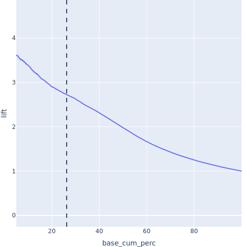
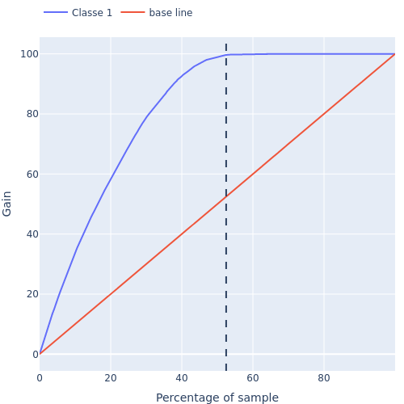
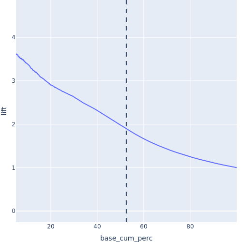

<h1 align='center'>  PROJETO DE CLASSIFICAÇÃO DE PROPENSÃO DE COMPRA DE UM SEGURO DE CARRO VIA VENDA CRUZADA  [projeto em andamento] </h1>

<i>Esse é um problema de negócio fictício, porém a empresa e os dados são reais assim como a solução do problema também é feita seguindo os passos que um projeto real seguiria.</i>

<i>Este README apresenta um apanhado dos métodos utilizados e dos principais resultados obtidos. Você pode obter mais detalhes visitando o 
<a href="https://github.com/MayconRochaaa/health_insurance/blob/main/notebooks/projeto.ipynb">Jupyter Notebook</a> do projeto.</i>

# 1.0 - **Problema de negócio**

## 1.1 - **Descrição do problema**

 Uma apólice de seguro é um acordo pelo qual uma empresa se compromete a fornecer uma garantia de compensação por perdas, danos, doenças ou morte especificados em troca do pagamento de um prêmio especificado. Um prêmio é uma quantia em dinheiro que o cliente precisa pagar regularmente a uma companhia de seguros por essa garantia. 

 Uma companhia de seguros que fornece diferentes tipos de seguros a seus clientes precisa construir de um modelo para prever se os segurados (clientes) que adquiriram seguro de saúde no ano anterior também estariam interessados no seguro de veículo fornecido pela empresa. 

 Construir um modelo para prever se um cliente estaria interessado em Seguro de Veículo é extremamente útil para a empresa, pois ela pode planejar sua estratégia de comunicação para alcançar esses clientes e otimizar seu modelo de negócios e receita.

## 1.2 - **Objetivos**

Como cientista de dados foi nos dado a tarefa de desenvolver um modelo de propensão de compra para prever quais clientes que já possuem um plano de saúde da mesma seguradora têm maior probabilidade de adquirir um seguro de carro. O objetivo é fornecer informações ao time de Marketing, permitindo que eles acessem facilmente esses clientes e desenvolvam uma estratégia de vendas eficaz. Além disso, foi solicitado que os resultados sejam disponibilizados em uma tabela no Google Sheets para facilitar o acesso e análise dos dados.

Além disso, após desenvolver o modelo, devemos responder as seguintes perguntas:

- Qual a porcentagem de clientes interessados em adquirir um seguro de automóvel, o time de vendas conseguirá contatar fazendo 20.000 ligações?

- Caso o número de ligações possíveis aumente  para 40.000, qual a porcentagem de clientes interessados em adquirir um seguro de automóvel o time de vendas conseguirá contatar?

- Quantas ligações o time de vendas precisa fazer para contatar 80% dos clientes interessados em adquirir um seguro de automóvel?

## 1.3 - **Visão geral dos dados**

 Os dados foram obtidos através da plataforma <a href="https://www.kaggle.com/datasets/anmolkumar/health-insurance-cross-sell-prediction">Kaggle</a>. Neles temos informações gerais sobre os clientes que já adquiriram o seguro de saúde oferecido pela seguradora. O dataset original contém as seguintes informações:

<strong> Descrição dos dados disponibilizados</strong> 

| Variável            | Descrição                                                                                           |
|---------------------|-----------------------------------------------------------------------------------------------------|
| id                  | ID único do cliente                                                                                 |
| Gender              | Gênero do cliente                                                                                   |
| Age                 | Idade do cliente                                                                                    |
| Driving_License     | 0: Cliente não possui CNH, 1: Cliente já possui CNH                                                 |
| Region_Code         | Código único para a região do cliente                                                               |
| Previously_Insured  | 1: Cliente já possui Seguro de Veículo, 0: Cliente não possui Seguro de Veículo                     |
| Vehicle_Age         | Idade do Veículo                                                                                    |
| Vehicle_Damage      | 1: Cliente teve seu veículo danificado no passado, 0: Cliente não teve seu veículo danificado      |
| Annual_Premium      | O valor que o cliente precisa pagar como prêmio anual                                              |
| Policy_Sales_Channel| Código anonimizado para o canal de abordagem ao cliente                                             |
| Vintage             | Número de dias que o cliente está associado à empresa                                              |
| Response            | 1: Cliente está interessado, 0: Cliente não está interessado                                       |

# 2.0 - **Premissas do negócio**

- 
Consideraremos clientes com menos de quatro meses de assinatura como novos; entre 4 e 8 meses, médios e acima de 8 meses, clientes antigos;

- 
A métrica a ser utilizada para avaliar o modelo será a Precison at K por se tratar de um problema de ordenação;

- 
A solução foi baseada no cenário em que capacidade de ligações do time de marketing é de 20000;

- 
Esse time deve ser capaz de consultar a base ordenada através Google Sheets.

# 3.0 - **Estratégia de soluçaõ**

 A estratégia de solução se baseia no método CRISP-DS (Adaptado do CRISP-DM) que prioriza e agiliza a entrega de resultado e valor do projeto. O ciclo é representado pelo esquema abaixo: 

 

 

- 
Business Problem e Business Understanding: Etapa inicial, recebemos o problema e procuramos entender as motivações que levaram o CFO solicitar a tarefa e com base nisso elaboramos uma estratégia de solução;

- 
Data Extraction: Coleta dos dados da pesquisa feita dos clientes que adquiriram o seguro de saúde e se interessam, ou não, pelo seguro de carro. Esses dados foram obtidos no site Kaggle;

- 
Data Cleaning: Aqui as colunas do dataset são renomeadas no modelo snake_case; analisamos e alteramos o tipo das variáveis quando necessário; preenchimento dos valores NaN com base no conhecimento do negócio;

    
Neste processo também é realizado a etapa de Feature Engineering, onde derivamos novas features a partir das originais. As novas features são criadas a partir da tentativa de validar hipóteses levantadas sobre os negócio, podendo ter impacto significativo no modelo de ML;

- 
Exploratory Data Analysis (EDA): A etapa mais importante de qualquer projeto de Data Science. Aqui vamos verificar a validade das hipóteses levantadas e obter insights do negócio. Ela foi dividida em três partes: análise univariada, bivariada e multivariada;

- 
Modeling: Nesta etapa os dados foram trabalhados para que possam performar melhor quando o modelo de ML for implementado. Este processo visa deixar todas variáveis numéricas em uma escala "justa", aplicando técnicas de normalização e reescalonamento, para que nenhuma feature tenha mais relevância que outra no modelo de ML; aplicar técnicas de encoding nas variáveis categóricas e transformações de natureza nas features e na variável resposta.

    
Nesta etapa também é feito o processo de Feature Selection, onde selecionamos apenas as variáveis relevantes para o modelo, com base nos resultados do processo de EDA e também aplicando o algoritmo Boruta;

- 
Machine Learning Algorithms: Treinamento do modelo utilizando diferentes algoritmos de regressão e aplicando o método de Cross-Validation modificado para séries temporais;

- 
Evaluation: É escolhido o algoritmo com melhor performance na etapa anterior com base na métrica Precision at K. Além disso também é feito a tradução desses resultados em termos de performance de negócio;

- 
Deployment: É criado uma API utilizando a plataforma Render, isso possibilita que qualquer pessoa possa utilizar o modelo para ordenar uma determinada base de clientes. Para criar uma interface mais amigável e acessível utilizou-se a API do Google App Script para criar uma funcionalidade no Google Sheets que possibilita a ordenação de tabelas por lá;

- 
Novo ciclo: Após o projeto entrar em produção o ciclo se repete, visando aperfeiçoar a performance do modelo.

## 3.1 Ferramentas utilizadas

|    <!-- -->   |                    <!-- -->                     |
|---------------|-------------------------------------------------|
|**Programação**| Python 3.11.4;   Jupyter Notebook;   VSCode. |
|**Visualização de dados**|   Plotly.  |
|**Bibliotecas de ML**|Sklearn; Scikit-Optimize, Xgboost; Boruta.|
|**Engenharia de software**| Flask;   Git; Github;   Render Cloud; Google App Script.|

  

# 4.0 - **Principais Insights**

## 4.1 Pessoas mais velhos tem mais interesse em adquirir o seguro de carro

## 4.2 Pessoas com carros mais antigos tendem a dispensar mais a oferta de seguro.

## 4.3 Pessoas que recém adquiriram o plano de saúde podem não se interessar de imediato em um seguro de carro

# 5.0 - **Modelos de Machine Learning**

Foram testados 4 modelos de ML, dois baseados em árvores: Random Forest e o XGBoost; KNN e Logistic Regression. As métricas de performance considerada foi a Precision at K e Recall at K, que são métricas de classificação, porém que medem o quão bem o modelo é capaz de ordenar uma lista, ou seja, o principal objetivo aqui não é necessariamente acertar qual cliente estará interessado no seguro, mas sim colocar os mais interessados no topo da lista. Abaixo a performance de cada algoritmo em k = 20000, em 25%, 50%, 75% e 100% da base: 
 

 

| Model Name           | Precision at k      | Recall at k         | Precision at 25%    | Recall at 25%       | Precision at 50%    | Recall at 50%       | Precision at 75%    | Recall at 75%       | Precision at 100%   | Recall at 100%      |
|----------------------|---------------------|---------------------|---------------------|---------------------|---------------------|---------------------|---------------------|---------------------|---------------------|---------------------|
| XGB                  | 0.662+/-0.0054     | 0.54+/-0.004       | 0.6653+/-0.0053    | 0.4989+/-0.0039    | 0.5956+/-0.0054    | 0.8931+/-0.0049    | 0.4442+/-0.0045    | 0.999+/-0.0002      | 0.3335+/-0.0034     | 1.0+/-0.0           |
| Logistic Regression | 0.6394+/-0.0039    | 0.524+/-0.002       | 0.6412+/-0.004     | 0.483+/-0.002      | 0.5801+/-0.0008    | 0.8741+/-0.0029    | 0.4421+/-0.0016    | 0.9992+/-0.0002     | 0.3319+/-0.0012     | 1.0+/-0.0           |
| Random Forest        | 0.6343+/-0.0015    | 0.5169+/-0.0029    | 0.6376+/-0.0023    | 0.4775+/-0.003     | 0.5842+/-0.0019    | 0.8751+/-0.002     | 0.4444+/-0.002     | 0.9984+/-0.0004     | 0.3338+/-0.0016     | 1.0+/-0.0           |
| KNN                  | 0.6034+/-0.0023    | 0.4915+/-0.0025    | 0.6054+/-0.002     | 0.4533+/-0.0034    | 0.5704+/-0.0023    | 0.8543+/-0.0036    | 0.4344+/-0.0038    | 0.9756+/-0.0015     | 0.3339+/-0.0027     | 1.0+/-0.0           |

Podemos notar que todos modelos possuem uma performance semelhante, seguiremos então como XGB que além do melhor resultado em k=20000 também é o mais rápido. Aplicando o método de optimização Bayesiana para encontrar o melhores hyper-parâmetros do modelo obtemos a performance abaixo, onde podemos notar uma pequena melhora.

 

| Model Name           | Precision at k      | Recall at k         | Precision at 25%    | Recall at 25%       | Precision at 50%    | Recall at 50%       | Precision at 75%    | Recall at 75%       | Precision at 100%   | Recall at 100%      |
|----------------------|---------------------|---------------------|---------------------|---------------------|---------------------|---------------------|---------------------|---------------------|---------------------|---------------------|
| XGB                  | 0.6653+/-0.0029    | 0.5404+/-0.0031    | 0.6699+/-0.0033    | 0.5002+/-0.0035    | 0.599+/-0.0032     | 0.8945+/-0.003     | 0.4461+/-0.0014    | 0.9992+/-0.0003     | 0.3349+/-0.0012     | 1.0+/-0.0           |

## 5.1 Performance do ponto de vista financeiro:

Abaixo temos as curvas de ganho cumulativo de de lift, respectivamente:

Gain curve             |  Lift Curve
:-------------------------:|:-------------------------:
  |  

A curva em laranja representa o modelo caso a base fosse ordenada de forma aleatória e diz que o número de pessoas que se interessam pelo seguro de carro cresce linearmente conforma vamos contatando a base. Já a a cura em azul é a curva de ganho cumulativo que representa como atingimos as pessoas interessadas no seguro seguindo o modelo criado. Enquanto em uma lista ordenada ao contatar 20% da base contatamos 20% dos interessados, ao consultar a lista ordenada pelo modelo atingiríamos aproximadamente 60% dos interessados. Essa métrica é mais simples de se enxergar olhando para a curva de lift, que diz quantas vezes a base ordenada com o modelo de ML é melhor que a base ordenada de forma aleatória, nesse caso, em 20% o modelo é cerca de 3 vezes melhor que a base ordenada de qualquer forma.

### 5.1.1 Qual a porcentagem de clientes interessados em adquirir um seguro de automóvel, o time de vendas conseguirá contatar fazendo 20.000 ligações?

Analisando o gráfico abaixo notamos que ao contatar 20000 clientes da base (cerca de 25%) conseguimos atingir cerca de 70% dos interessados (intersecção da reta pontilhada com a curva azul). Quando comparado com o caso onde a ordenação é aleatória (Figura abaixo) notamos que nosso modelo é cerca de 2,75 vezes melhor.

Gain curve at 20.000             |  Lift Curve at 20.000 
:-------------------------:|:-------------------------:
  |  

### 5.1.2 Caso a capacidade do time de vendas aumente para 40.000 ligações, qual a porcentagem de clientes interessados em adquirir um seguro de automóvel o time de vendas conseguirá contatar?

Quando a capacidade de ligações passa a ser de 40000, ao analisar a figura acima, podemos ver que conseguimos atingir quase 100% dos interessados, cerca de duas vezes melhor que o modelo aleatório, como mostrado na imagem abaixo.

Gain curve             |  Lift Curve
:-------------------------:|:-------------------------:
  |  

### 5.1.3 Quantas ligações o time de vendas precisa fazer para contatar 80% dos clientes interessados em adquirir um seguro de automóvel?

Analisando as imagens acima vemos que é necessário atingir cerca de 30% da base para atingir 80% dos interessados.

## 5.2 Retorno finaceiro

Considerando um cenário em que a base de clientes a ser contatada contabiliza 76222 clientes, é possível estimar o retorno financeiro que a empresa terá ao utilizar lista rankeada para entrar em contato com os clientes. Para isso assumimos as seguintes premissas:

O valor anual médio do seguro de carro é de 36000. Além disso assumiremos que as pessoas que responderam estar interessadas no seguro irão de fato adquiri-lo. Portanto assumindo também que o time de negócios possuem apenas 20000 ligações.

Desse modo, a receita bruta esperada através dos seguros vendidos aos clientes contatados utilizando a lista rankeada é de: $518.400.000,00. Enquanto que  utilizando a random list é de: $187.200.000,00 (mais detalhes das contas estão no notebook). Isso significa que o modelo é cerca de 2,8 vezes melhor do que ao ordenar a lista aleatoriamente, ou seja, foram economizados cerca de 331.200.000 reais ao utilizar o modelo.

# 6.0 - **Produto Final**

Para disponibilizar esses resultados de forma prática e remota foi criado a API-Healin utilizando a biblioteca Flask e feito o deploy na plataforma Render. Através do Google App Scripts acessamos essa API e criamos um botão no Google Sheets que ordena tabelas automaticamente com base no modelo treinado.

# 7.0 - **Conclusões**

O primeiro ciclo do CRISP-DS foi concluído com sucesso, passamos por todas etapas essências de um projeto real de ciência de dados. Obtemos insights preciosos sobre os clientes interessados em adquirir o seguro durante o processo de EDA, que possibilitou definir um conjunto de features que entrega uma performance satisfatória ao utilizar o modelo XGBoost, possibilitando uma ordenação da lista de clientes com potencial interesse no seguro de carro, sendo cerca de 2,8 vezes melhor que uma lista não ordenada. Esse resultado se traduz para o mundo de negócios como um potencial de economizar algo em torno de 331.200.000 reais ao utilizar o modelo para ordenação dos clientes.

O modelo foi colocado em produção e desenvolvido uma funcionalidade no Google Sheets que possibilita a ordenação de tabelas de clientes de forma prática e facilitada.

# 8.0 - **Próximos passos**

A performance do modelo ainda possuí margem para ser aprimorada mais. Ao iniciar um novo ciclo do CRISP-DS podemos abordar as seguintes estratégias:

Elaborar mais hipóteses sobre o negócio para gerar mais Features que podem ser relevantes para descrever o problema;

Testar diferentes algoritmos de Machine Learning, inclusive criar Stacking de modelos;

# Contato:     